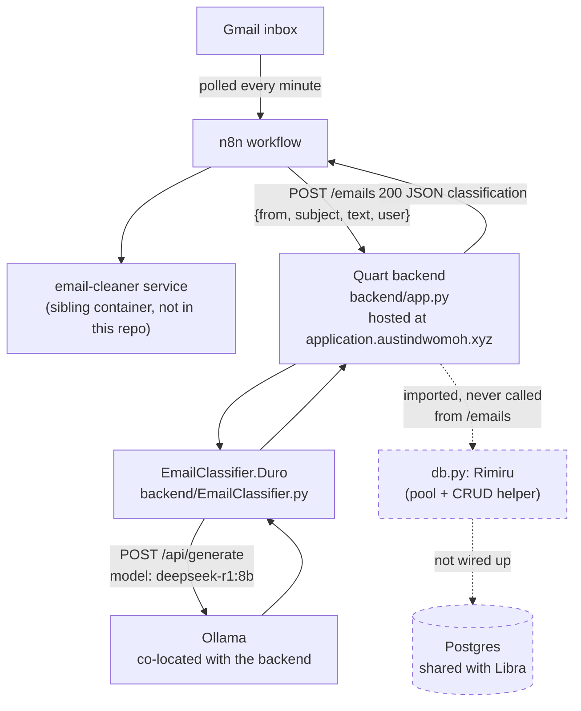

# Architecture — current, server-hosted classification path

This is the path that actually runs against real Gmail traffic today. It's
separate from the Tauri scaffolding described in
[[architecture_target|architecture_target.md]] — see the note at the bottom.

## What's real vs. scaffolded

- **Solid arrows** are the actual request path n8n exercises today: Gmail →
  n8n → email-cleaner → Quart `/emails` → Ollama → response back to n8n.
- **Dashed arrows** exist in code (`Rimiru`/`db.py` has a full connection-pool
  and CRUD layer, configured via the same `PGHOST`/`PGUSER`/etc. env vars a
  Libra deployment would use) but are never invoked — no row is ever written
  for a classified email. The classification result goes back to n8n in the
  HTTP response and is dropped there (see [[Ingest-Pipeline]]).
- There is no deploy workflow for Scales in `.github/workflows/` (only
  `Notify.yaml`, which just posts to Discord on push/issue events) — how
  `application.austindwomoh.xyz` gets updated isn't automated/documented in
  this repo.
- The React frontend (`frontend/src/App.jsx`) is still the unmodified Vite
  starter template — it doesn't call the backend at all yet. The product UI
  (viewing tracked applications, statuses, etc.) hasn't been built.
