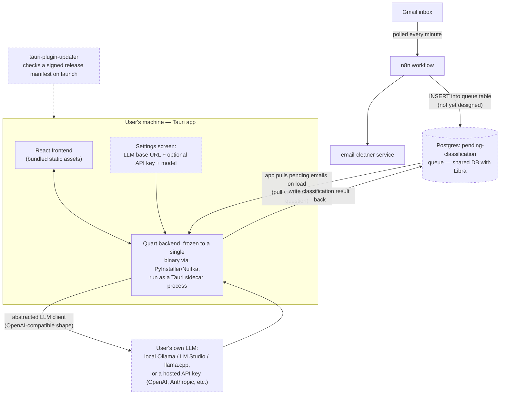

# Architecture — target, Tauri desktop end state

Where the migration described in `to-do.md` is headed. Nothing on this
diagram is running yet except the pieces marked "scaffolded" — see
[[Desktop-Migration]] for decided-vs-open status of each step.

## Already scaffolded (in this repo today)

- `src-tauri/` exists with a default Tauri v2 shell (`tauri.conf.json`,
  `lib.rs`, `main.rs`, `capabilities/default.json`) — window title/size set,
  no custom Rust commands yet.
- Root `package.json` wires `npm run dev` to run the Quart backend
  (`scripts/run-backend.js`, via the venv's own Python — **not** a frozen
  binary yet) and `tauri dev` concurrently, with Tauri's `beforeDevCommand`
  pointing at the Vite dev server.
- `scripts/setup.js` installs the backend venv, Rust/rustup, platform build
  deps (WebView2, VS Build Tools / webkit2gtk / Xcode CLT), and the frontend +
  Tauri CLI deps in one pass.

## Not yet started

- No `externalBin` sidecar entry in `tauri.conf.json` — the backend isn't
  packaged as a binary at all yet (dashed items above).
- No abstracted LLM client — `EmailClassifier.Duro` still hardcodes an Ollama
  `http://localhost:11434` call with `model="deepseek-r1:8b"`.
- No settings UI — `App.jsx` is still the default Vite template.
- No queue table, no pull/push decision, no multi-device claiming logic —
  explicitly called out as open in `to-do.md`.
- No `tauri-plugin-updater` wiring, no signing keypair generated.
