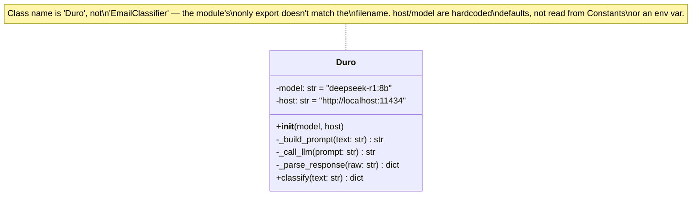

# Class diagram — `backend/EmailClassifier.py`



## Notes

- `_call_llm` posts to Ollama's `/api/generate` with `stream: false` and a
  fixed 60s `httpx` timeout — no retry logic if Ollama is slow/unavailable.
- `_parse_response` strips a `<think>...</think>` block (deepseek-r1 emits
  chain-of-thought before its answer) and any ```` ```json ```` fences before
  `json.loads`. On a `JSONDecodeError` it silently falls back to
  `{is_application_related: False, company_name: None, role_title: None,
  status: None}` rather than raising — a malformed LLM response looks
  identical to "this isn't a job email."
- `status` is prompted as one of `applied, oa, interview, rejected, offer,
  ghosted` but nothing in `_parse_response` validates the LLM actually
  returned one of those values — any string (or `null`) passes through.
- No constructor argument or config wires `model`/`host` to `Constants` — to
  point this at a different Ollama host you'd currently have to edit the
  default arguments directly. This is the piece [[Desktop-Migration]] step 3
  plans to replace with a user-configurable, provider-agnostic client.
