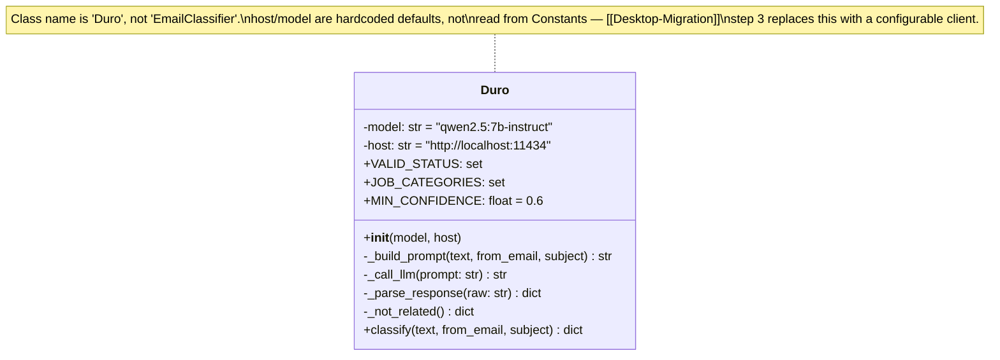

# Class diagram — `backend/EmailClassifier.py`



## Notes

- `classify()` first parses the `From` header with `email.utils.parseaddr`
  and returns `_not_related()` without calling the LLM when the bare address
  is in `KNOWN_NON_APPLICATION_SENDERS`
  (`jobalerts-noreply@linkedin.com`, `notifications@github.com`,
  `noreply@github.com`).
- `_call_llm` posts to Ollama's `/api/generate` with `stream: false`,
  300s read timeout, no retry.
- `_parse_response` strips a `<think>...</think>` block and ```` ```json ````
  fences, then `json.loads`. On `JSONDecodeError` → `_not_related()`.
- **The verdict gate:** `is_application_related` is only true when the model
  says so **and** `category ∈ JOB_CATEGORIES` **and**
  `confidence ≥ MIN_CONFIDENCE` **and** `status` is non-null. `status` is also
  validated against `VALID_STATUS` (else coerced to `null`).
- Every return path (`_not_related()` and the full parse) yields the same
  seven-key dict: `is_application_related, category, confidence, reason,
  company_name, role_title, status`.
- The prompt uses `<COMPANY>`/`<ROLE>` placeholders in its few-shot examples
  and tells the model to copy names only from the actual email — a 7B model
  otherwise echoes example names into its answer.

See [[Classification]] for the prose walkthrough and [[Database-Layer]] for
`resolve_application`, which consumes the result.
