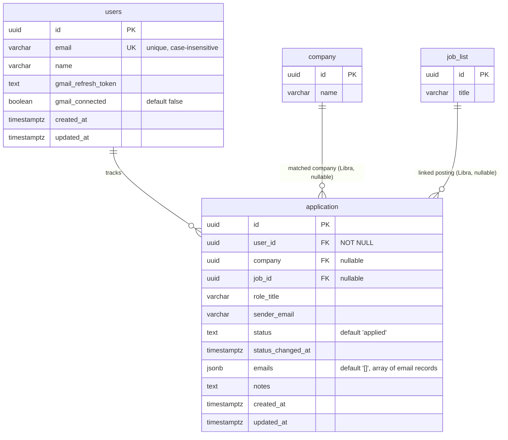

# Data model

Two Scales-owned tables (`users`, `application`) plus two foreign keys into
Libra's existing tables (`company`, `job_list`) in the same shared Postgres
instance. Not present as a migration/schema file anywhere in this repo — like
Libra, schema changes here have been manual `CREATE`/`ALTER` statements
against the live DB.

`company` and `job_list` are Libra's tables (see Libra's Database-Layer wiki
page) — only shown here as FK targets, not owned by Scales.

## The dedup key isn't quite "one row per company+role"

`application_user_company_sender_unique` is a `UNIQUE` index on
`(user_id, company, lower(sender_email))` — **`role_title` is not part of
it.** So the actual natural key today is one row per
(user, company, sender email), not per (user, company, role). Two different
roles at the same company, if their status-update emails come from the same
`sender_email`, would collide on this constraint rather than getting
separate rows. Worth confirming whether that's intentional (e.g. most ATS
systems email from one no-reply address per company regardless of role) or
whether `role_title` should be part of the key. See [[Database-Layer]].

## Open questions this raises for [[Desktop-Migration]]

- The pending-classification queue design (not yet built) will need to
  resolve incoming emails to a `user_id` — `users.gmail_connected` /
  `gmail_refresh_token` suggest a per-user Gmail OAuth connection is planned,
  but the n8n workflow reviewed for [[Ingest-Pipeline]] authenticates via a
  single shared n8n-managed Gmail credential, not a per-user token from this
  table. How those two reconcile isn't decided yet.
- `application.company` and `application.job_id` are both nullable — a
  classified email that doesn't confidently match an existing Libra
  `company`/`job_list` row presumably still needs an `application` row
  created (`company_name`/`role_title` as free text until/if matched), but
  the matching logic itself doesn't exist in this repo yet.
