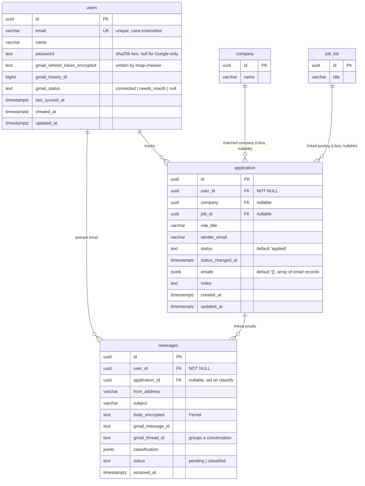

# Data model

`users` and `application` (Scales), `messages` (the imap-checker service),
plus foreign keys into Libra's existing `company` and `job_list` tables — all
in the same shared Postgres instance. Not present as a migration/schema file
anywhere in this repo — like Libra, schema changes here have been manual
`CREATE`/`ALTER` statements against the live DB.

`messages` is owned by the imap-checker service (not this repo); shown here
because `resolve_application` reads and writes it.

`company` and `job_list` are Libra's tables (see Libra's Database-Layer wiki
page) — only shown here as FK targets, not owned by Scales.

## The dedup key: one row per (user, company)

`application_user_company_unique` is a `UNIQUE` index on `(user_id, company)`
(it replaced `application_user_company_sender_unique`, which keyed on
`sender_email` and split one hiring process across rows every time a new
sender wrote in).

`resolve_application` (`backend/routes/emails.py`) matches an incoming email
to an application in two layers — first by Gmail thread
(`messages.gmail_thread_id`), then by canonicalized company name. See
[[Database-Layer]] for the full logic. Trade-off: two different roles at the
same company now share one row.

`messages` (owned by the imap-checker service) carries `gmail_thread_id` and
an `application_id` FK back into `application` — that's the join that powers
thread-based grouping and the dashboard's "open in Gmail" link.

## Open questions this raises for [[Desktop-Migration]]

- The pending-classification queue design (not yet built) will need to
  resolve incoming emails to a `user_id` — `users.gmail_connected` /
  `gmail_refresh_token` suggest a per-user Gmail OAuth connection is planned,
  but the n8n workflow reviewed for [[Ingest-Pipeline]] authenticates via a
  single shared n8n-managed Gmail credential, not a per-user token from this
  table. How those two reconcile isn't decided yet.
- `application.company` and `application.job_id` are both nullable.
  `resolve_application` now always resolves a `company` row (creating one from
  the canonicalized `company_name` if needed), so `company` is populated in
  practice; `job_id` is still never set — no `job_list` matching exists yet.
- Existing `company` rows created before `_canonical_company` may still be
  split ("Google" vs "Google LLC"). New writes are canonicalized; a one-time
  `company`-table dedup would be needed to merge the historical ones, and
  `company` is Libra's table.
