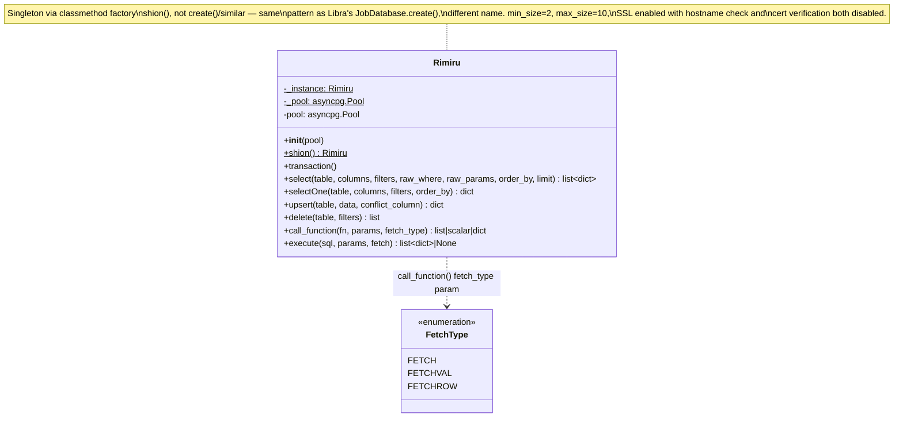

# Class diagram — `backend/db.py`

## Notes

- `shion()` is the async factory/singleton accessor — mirrors Libra's
  `JobDatabase.create()` pattern (pool built once, cached on the class), just
  named differently. There is no table-name constant anywhere in this file —
  every caller passes its own table string, and today there are no callers
  (see [[architecture_current]]).
- `execute()`'s docstring is the only place in the file warning that
  table/column names must come from trusted code, not request data — `sql`
  itself is never validated, only parameterized via `$1, $2...` placeholders.
- `upsert()` wraps its body in `try/except Exception: raise` — this
  re-raises unchanged, so it has no actual effect on error handling; worth
  removing rather than reading as a real except-and-handle block.
- `Rimiru`/`Duro` names don't describe what the classes do (a DB layer and an
  LLM classifier, respectively) — likely a naming convention or in-joke
  carried over from elsewhere in the codebase, not something with functional
  significance for readers of this doc.
