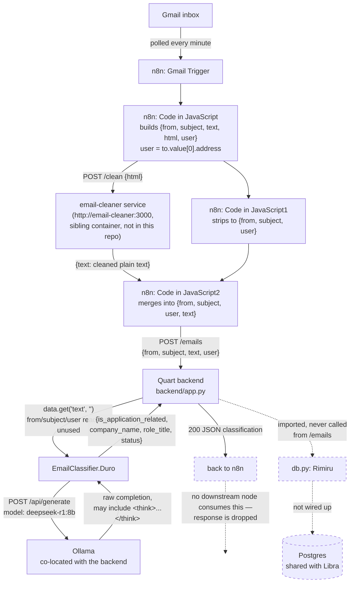

# Ingest flow — Gmail → n8n → email-cleaner → Quart → Ollama

Current, as of the n8n workflow export reviewed for this doc. Slated to change —
see the note at the bottom and [[Desktop-Migration]].

## Notes / things worth knowing

- **`email-cleaner` is not in this repo.** It's a sibling service reached at
  `http://email-cleaner:3000/clean` (n8n-internal hostname, so it's on the
  same Docker network as n8n) that turns an email's raw HTML into plain
  text. Its source isn't part of the Scales codebase.
- **The final n8n HTTP Request node's JSON body has a malformed key**:
  `"jsonBody"` contains `\"user\"\":\"{{ $json.user }}\"` — an extra `"`
  after `user`. Worth checking in the n8n editor whether this actually
  serializes correctly today; it reads as broken JSON.
- **`from`, `subject`, and `user` are sent but never read.** `backend/app.py`'s
  `/emails` route only pulls `data.get("text", "")` out of the request body —
  the email's sender, subject, and destination user are currently discarded
  server-side.
- **No database write happens in this flow** (dashed edges above). `backend/db.py`
  (`Rimiru`) is imported in `app.py` but never called from the `/emails` route —
  the classification result is computed and returned in the HTTP response, not
  persisted anywhere.
- **Planned change**: per the project owner, this synchronous
  n8n → Quart → Ollama call is going away in favor of n8n writing incoming
  emails to a Postgres queue table, which the (future Tauri) desktop app
  will pull from on load to classify client-side and write results back.
  See [[Desktop-Migration]] and `to-do.md` in the repo root.
