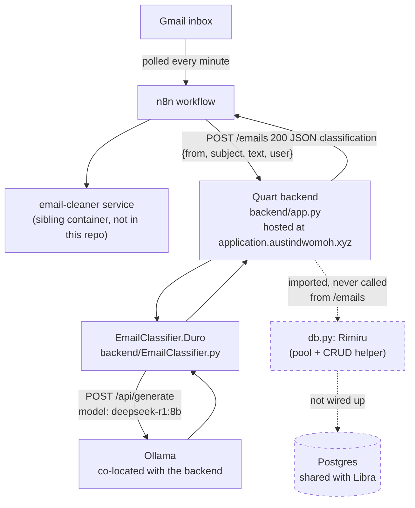
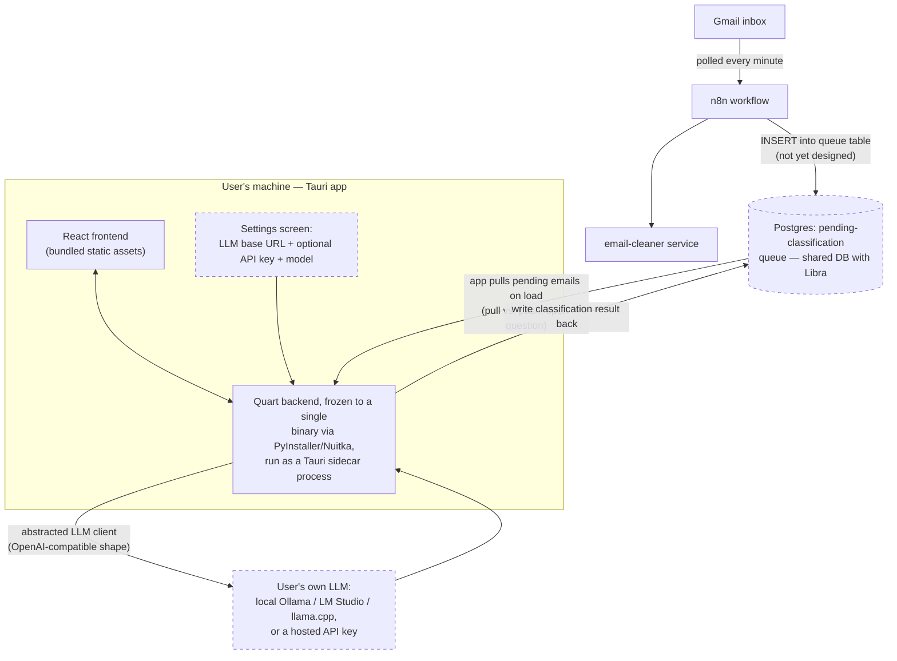

# Architecture

## Current, server-hosted state

This is the path that actually runs against real Gmail traffic today.

Solid arrows are exercised on every real request. Dashed arrows exist in code
but nothing on the live path calls them — see [[Ingest-Pipeline]] for the
full walkthrough and [[Database-Layer]] for what `Rimiru` can do once it's
actually wired up.

There is no deploy workflow for Scales in `.github/workflows/` (only
`Notify.yaml`, a Discord notifier) — how the hosted backend actually gets
updated isn't automated or documented in this repo. The React frontend
(`frontend/src/App.jsx`) is still the unmodified Vite starter template; it
doesn't call the backend at all yet.

## Target: Tauri desktop state

Where the migration in `to-do.md` is headed. Nothing below is running yet
except the pieces marked "scaffolded" in [[Desktop-Migration]].

## Backend module map

The backend is four files today:

- `app.py` — Quart app, single `/emails` route, CORS locked to
  `http://localhost:5173` (the Vite/Tauri dev origin).
- `EmailClassifier.py` — `Duro`, the Ollama-backed classifier. See
  [[Classification]] and `docs/diagrams/classification_class.md`.
- `db.py` — `Rimiru`, a generic asyncpg pool + CRUD layer (select/upsert/
  delete/execute), currently unused. See [[Database-Layer]] and
  `docs/diagrams/db_class.md`.
- `constants.py` — reads `PGHOST`/`PGPORT`/`PGUSER`/`PGPASSWORD`/`PGDATABASE`/
  `SECRET_KEY` from the environment via `python-dotenv`, plus an unrelated
  `format_due_date()` helper and a `FetchType` enum used by `Rimiru.call_function`.

See [[Diagrams]] for the full index of Mermaid diagrams backing this page.
