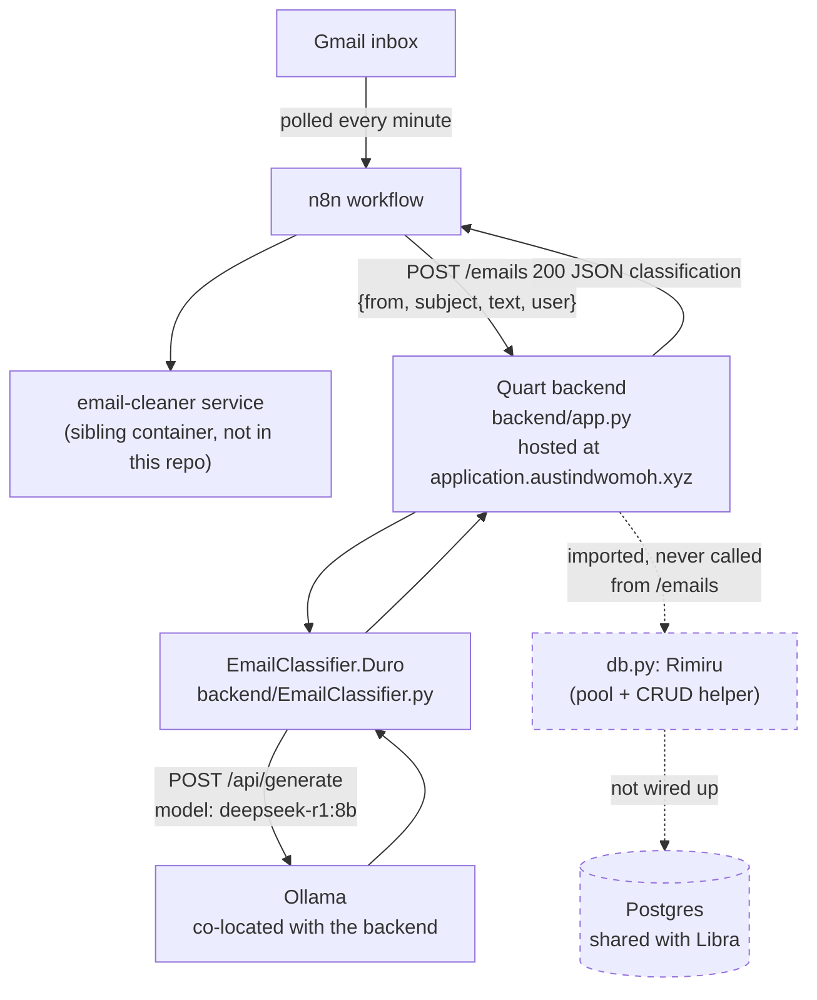
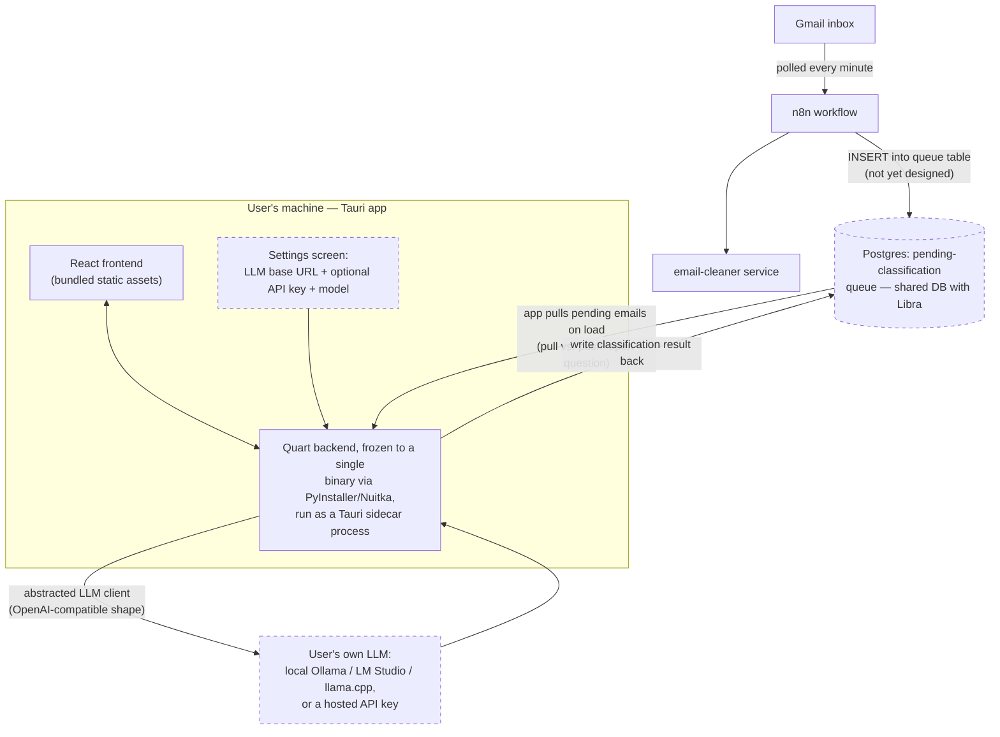

# Architecture

> The flowcharts on this page predate the per-user Gmail OAuth + `messages`
> queue rework and are kept for the target-state comparison. For the flow that
> actually runs today see [[Ingest-Pipeline]] ("Current flow") and
> [[Database-Layer]].

## Earlier server-hosted state (n8n, superseded)

Solid arrows are exercised on every real request. Dashed arrows exist in code
but nothing on the live path calls them — see [[Ingest-Pipeline]] for the
full walkthrough and [[Database-Layer]] for what `Rimiru` can do once it's
actually wired up.

There is no deploy workflow for Scales in `.github/workflows/` (only
`Notify.yaml`, a Discord notifier) — how the hosted backend actually gets
updated isn't automated or documented in this repo. The React frontend
(`frontend/src/App.jsx`) is still the unmodified Vite starter template; it
doesn't call the backend at all yet.

## Target: Tauri desktop state

Where the migration in `to-do.md` is headed. Nothing below is running yet
except the pieces marked "scaffolded" in [[Desktop-Migration]].

## Backend module map

- `app.py` — Quart app; registers the `auth`, `emails`, and `application`
  blueprints; CORS locked to `http://localhost:5173`. The `/emails` route
  here is a leftover stub that echoes its body — the real ingest path is the
  `messages` queue.
- `routes/auth.py` — email/password login + register, Google OAuth login.
  When a user has no Gmail connection it redirects the browser to
  imap-checker's `connect/start`; once connected, login fire-and-forgets
  `classify_pending_emails`.
- `routes/emails.py` — `classify_pending_emails` (background queue drain),
  `/api/emails/sync-status` (poll for the "N/M processed" spinner), and
  `resolve_application` (thread- then company-based grouping). See
  [[Database-Layer]].
- `routes/application.py` — `GET /api/application/dashboard`: the user's
  applications joined to `company` and their latest message, plus recent
  enriched `job_list` rows from Libra.
- `EmailClassifier.py` — `Duro`, the Ollama-backed classifier. See
  [[Classification]] and `docs/diagrams/classification_class.md`.
- `db.py` — `Rimiru`, an asyncpg pool + CRUD layer
  (select/upsert/delete/call_function/execute), now used on both the read and
  write paths. See [[Database-Layer]] and `docs/diagrams/db_class.md`.
- `logger.py` — per-run structured logging. See [[Logging]].
- `useCheck.py` — `@require_user`, resolves the session cookie to
  `g.current_user` or returns 401.
- `constants.py` — env config (`PG*`, `SECRET_KEY`, `GOOGLE_CLIENT_ID/SECRET`,
  `FRONTEND_URL`, `EMAIL_ENDPOINT`) via `python-dotenv`, plus a `FetchType`
  enum and an unrelated `format_due_date()` helper.

See [[Diagrams]] for the full index of Mermaid diagrams backing this page.
