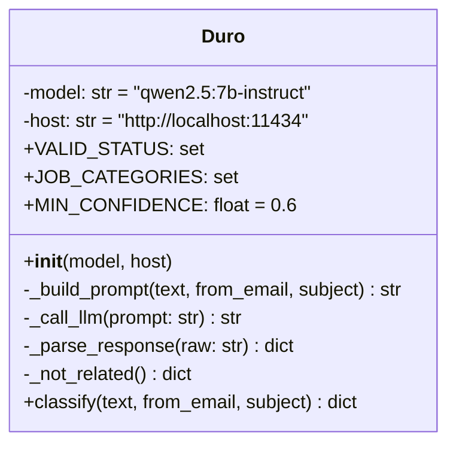

# Classification

`backend/EmailClassifier.py` defines a single class, `Duro` (the module's
name doesn't match its only export). This is what turns raw email text into
a structured classification.



## The classification dict

`classify()` returns:

```json
{
  "is_application_related": true | false,
  "category": "job|internship|co_op|apprenticeship|fellowship|new_grad|other|none",
  "confidence": 0.0-1.0,
  "reason": "one short sentence",
  "company_name": "string or null",
  "role_title": "string or null",
  "status": "applied|oa|interview|rejected|offer|ghosted or null"
}
```

Only `is_application_related`, `company_name`, `role_title` and `status` are
consumed downstream (by `resolve_application` in
`backend/routes/emails.py` — see [[Database-Layer]]); `category`, `confidence`
and `reason` exist for logging and for the gate below.

## Three checks before the LLM verdict is trusted

Earlier versions marked an email application-related on the LLM's boolean
alone, which let through anything mentioning "apply". `_parse_response` now
requires **all** of:

1. `is_application_related` true from the model, **and**
2. `category` in `JOB_CATEGORIES`
   (`job / internship / co_op / apprenticeship / fellowship / new_grad`), **and**
3. `confidence >= MIN_CONFIDENCE` (0.6), **and**
4. `status` is non-null — a real step in a hiring process always maps to one
   of the six statuses; an announcement or alert doesn't.

If any fails, the result is coerced to "not related" and the reason is logged.
This is what keeps out credit-card / loan / admissions / apartment
"applications", job-alert digests, and "a new role was posted" notifications.

## Sender short-circuit

`classify()` runs `email.utils.parseaddr` on the `From` header (so
`Name <addr@host>` still matches) and, if the bare address is in
`KNOWN_NON_APPLICATION_SENDERS`, returns `_not_related()` without calling the
LLM at all. Current list: `jobalerts-noreply@linkedin.com`,
`notifications@github.com`, `noreply@github.com` — the GitHub ones because
listing repos (SimplifyJobs, Pitt CSC, …) fire an issue notification for
every new posting, which the model otherwise misreads as an application step.

## The prompt

`_build_prompt()` wraps the email in a fixed template that:

- defines the JSON shape above,
- lists the true-only-if conditions (evidence the user *already applied*: "we
  received your application", recruiter outreach, an OA to complete, an
  interview invite, a rejection, an offer),
- lists the false cases explicitly, including **"notification that a new
  job/internship was POSTED"** (GitHub/Discord/Slack posting bots, listing
  repos),
- instructs that `company_name` / `role_title` must be **copied verbatim from
  this email** and never taken from the examples or invented,
- gives four few-shot examples using `<COMPANY>` / `<ROLE>` placeholders
  rather than real names (a small model will otherwise echo a real-looking
  example name straight into its answer).

## Parsing the response

`_parse_response()`:

1. Strips a `<think>...</think>` block if present (some reasoning models emit
   chain-of-thought first).
2. Strips ```` ```json ````/```` ``` ```` fences.
3. `json.loads`s what's left; on `JSONDecodeError` returns `_not_related()`.
4. Coerces `category`/`confidence`, validates `status` against
   `VALID_STATUS` (anything else → `null`), then applies the four-part gate.

Still true and worth knowing when debugging:

- **A malformed LLM response is indistinguishable from "not a job email"** —
  both return `_not_related()`, so a parse failure surfaces only in the
  `WARNING` log line, not as an error.

## The Ollama dependency

`_call_llm()` POSTs to `{host}/api/generate` with `stream: false` and an
`httpx` timeout of 300s read / 10s connect — no retry. `model`
(`qwen2.5:7b-instruct`) and `host` (`http://localhost:11434`) are constructor
defaults, not read from `constants.py`. [[Desktop-Migration]] plans to
replace this with a provider-agnostic, per-user-configurable client.

## Where this fits in the pipeline

See [[Ingest-Pipeline]] for how an email reaches `Duro.classify()`, and
[[Database-Layer]] for `resolve_application` — what turns a positive
classification into (or onto an existing) `application` row.
