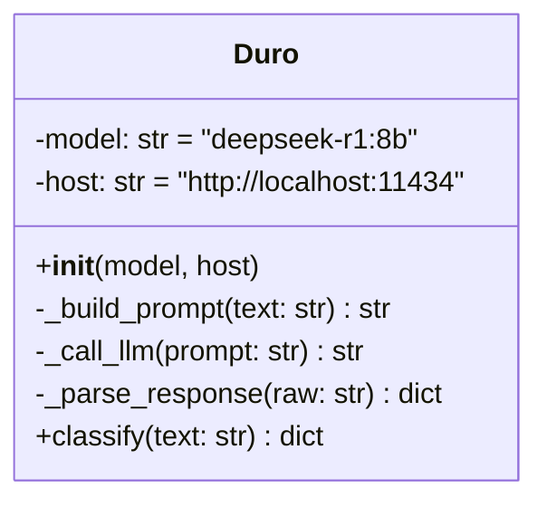

# Classification

`backend/EmailClassifier.py` defines a single class, `Duro` (the module's
name doesn't match its only export). This is what turns raw email text into
a structured classification.



## The prompt

`_build_prompt()` wraps the email text in a fixed instruction template that
asks for **only** a JSON object, no other text, shaped like:

```json
{
  "is_application_related": true or false,
  "company_name": "string or null",
  "role_title": "string or null",
  "status": "one of: applied, oa, interview, rejected, offer, ghosted, or null"
}
```

with instructions to mark confirmations/interview invites/assessment
requests/rejections/offers as related, mark marketing/newsletters as
unrelated, and use `null` rather than guessing when unsure.

## The Ollama dependency

`_call_llm()` POSTs to `{host}/api/generate` with `model`, the prompt, and
`stream: false`, using a plain `httpx.AsyncClient` with a 60s timeout — no
retry on failure or timeout. Both `model` (`deepseek-r1:8b`) and `host`
(`http://localhost:11434`) are constructor defaults, not read from
`constants.py` or an environment variable — changing them today means
editing the class definition directly.

This is the piece of the codebase most directly affected by the desktop
migration: [[Desktop-Migration]] plans to replace this hardcoded Ollama call
with a provider-agnostic client (base URL + optional API key + model name),
configured per-user instead of hardcoded per-deployment.

## Parsing the response

`_parse_response()`:

1. Strips a `<think>...</think>` block if present — `deepseek-r1` emits
   chain-of-thought reasoning before its actual answer, and this discards it.
2. Strips leading/trailing ```` ```json ````/```` ``` ```` fences.
3. `json.loads`s what's left.
4. On a `JSONDecodeError`, returns a default "not application-related, all
   fields null" dict rather than raising.

Two things worth knowing if you're debugging a classification that looks
wrong:

- **A malformed LLM response is indistinguishable from "not a job email."**
  Both produce the exact same fallback dict, so a parsing failure won't show
  up as an error anywhere — it'll just look like the classifier decided the
  email wasn't relevant.
- **`status` isn't validated against the allowed list.** The prompt asks for
  one of `applied, oa, interview, rejected, offer, ghosted`, but
  `_parse_response()` passes through whatever string (or `null`) the model
  returned, unchecked.

## Where this fits in the pipeline

See [[Ingest-Pipeline]] for how a request reaches `Duro.classify()`, and
[[Database-Layer]] for what happens to the result after — as of this writing,
nothing; it's returned in the HTTP response and not persisted.
