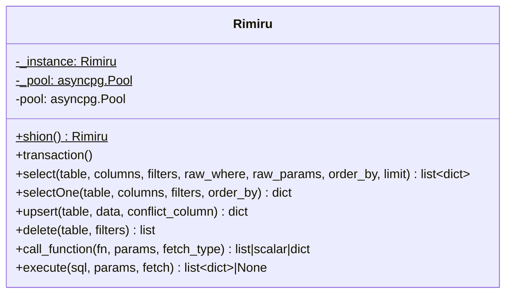

# Database Layer

## `db.py` — `Rimiru`

A singleton wrapping an `asyncpg` connection pool (min 2 / max 10). Accessed
via the async classmethod factory `Rimiru.shion()` — same singleton pattern
as Libra's `JobDatabase.create()`, different name. SSL is enabled on the pool
with `check_hostname` and `verify_mode` both disabled (`ssl.CERT_NONE`) —
worth confirming this is intentional (typical for a managed Postgres provider
behind a proxy) rather than an oversight, since it skips certificate
validation entirely.



Connection config comes from `constants.py` (`PGHOST`, `PGPORT`, `PGUSER`,
`PGPASSWORD`, `PGDATABASE`, loaded via `python-dotenv` from `backend/.env`) —
the same environment-variable shape a Libra deployment uses, since both
projects are meant to point at the same Postgres instance with separate
migrations.

**Nothing in `backend/app.py` calls `Rimiru` today.** The `/emails` route
computes a classification and returns it in the HTTP response; no row is
ever selected, inserted, or updated. See [[Ingest-Pipeline]] for the full
request path and [[architecture_current]] for where this shows up as a
dashed (not-wired-up) edge.

## Methods

| Method | Notes |
|---|---|
| `shion()` | classmethod, singleton — returns the existing instance if the pool is already built |
| `select(table, columns, filters, raw_where, raw_params, order_by, limit)` | supports a simple `filters` dict (`col = $n`) and/or a `raw_where` string with `raw_params` for anything more complex |
| `selectOne(...)` | thin wrapper, `limit=1` |
| `upsert(table, data, conflict_column)` | `INSERT ... ON CONFLICT (conflict_column) DO UPDATE SET ...`, JSON-encodes dict/list values before insert |
| `delete(table, filters)` | plain `DELETE ... WHERE ...` |
| `call_function(fn, params, fetch_type)` | calls a Postgres function; `fetch_type` is a `FetchType` enum (`FETCH`/`FETCHVAL`/`FETCHROW`) |
| `execute(sql, params, fetch)` | escape hatch for raw SQL (joins, `INSERT ... SELECT`, etc.) — the docstring notes values must always go through `$1, $2...` placeholders, never string-interpolated |

Unlike Libra's `JobDatabase`, `Rimiru` has no `bulk_upsert` and no
`_serialize`/`_json_default` helpers for UUID/datetime-safe JSON encoding —
`upsert()` inlines `json.dumps(v) if isinstance(v, (dict, list)) else v`
directly, so a `dict`/`list` value containing a `UUID` or `datetime` would
raise `TypeError` the way Libra's did before that fix was added there.

## Schema

No `CREATE TABLE` statement, migration file, or ORM model exists anywhere in
this repo — like Libra, schema changes have been manual statements run
directly against the live shared Postgres instance. This is the schema as it
exists on that live DB today; see [[Diagrams]] for the ER diagram
(`docs/diagrams/data_model.md`).

```sql
CREATE TABLE users(
     id uuid NOT NULL DEFAULT gen_random_uuid(),
    email varchar(255) NOT NULL,
    name varchar(255),
    gmail_refresh_token text,
    gmail_connected boolean DEFAULT false,
    created_at timestamp with time zone DEFAULT CURRENT_TIMESTAMP,
    updated_at timestamp with time zone DEFAULT CURRENT_TIMESTAMP ,
    PRIMARY KEY(id)
);
CREATE UNIQUE INDEX users_email_unique ON public.users USING btree (lower((email)::text));

CREATE TABLE application(
     id uuid NOT NULL DEFAULT gen_random_uuid(),
    user_id uuid NOT NULL,
    company uuid,
    job_id uuid,
    role_title varchar(1000),
    sender_email varchar(255),
    status text NOT NULL DEFAULT 'applied'::text,
    status_changed_at timestamp with time zone DEFAULT CURRENT_TIMESTAMP,
    emails jsonb NOT NULL DEFAULT '[]'::jsonb,
    notes text,
    created_at timestamp with time zone DEFAULT CURRENT_TIMESTAMP,
    updated_at timestamp with time zone DEFAULT CURRENT_TIMESTAMP ,
    PRIMARY KEY(id) ,
    CONSTRAINT application_user_fkey FOREIGN key(user_id) REFERENCES users(id),
    CONSTRAINT application_company_fkey FOREIGN key(company) REFERENCES company(id),
    CONSTRAINT application_job_fkey FOREIGN key(job_id) REFERENCES job_list(id)
);
CREATE INDEX application_user_id_index ON public.application USING btree (user_id);
CREATE UNIQUE INDEX application_user_company_sender_unique ON public.application USING btree (user_id, company, lower((sender_email)::text));
```

`company` and `job_id` FK straight into **Libra's** `company` and `job_list`
tables (see Libra's Database-Layer wiki page for those) — confirming the
"same DB, separate migrations" relationship: Scales doesn't duplicate Libra's
company/job data, it references it directly. Both are nullable, so an
`application` row can exist without a resolved match to either.

### `application` is the "one row per company+role" table

`emails jsonb NOT NULL DEFAULT '[]'` is the emails-array column. `status`
is free-text (`default 'applied'`) — nothing in the schema constrains it to
the `applied/oa/interview/rejected/offer/ghosted` set that
[[Classification]]'s prompt uses, so the two aren't enforced to stay in sync
at the DB level.

**The unique constraint doesn't actually include `role_title`.**
`application_user_company_sender_unique` is on
`(user_id, company, lower(sender_email))` — so the real natural key today is
one row per (user, company, *sender email*), not per (user, company, *role*).
Two different roles at the same company would collide on this constraint if
their status-update emails share a `sender_email`. Worth confirming whether
that's intentional (many ATSes send from one no-reply address regardless of
role) or whether `role_title` needs to join the key.

### `users.gmail_refresh_token` / `gmail_connected` vs. the current n8n setup

`users` has columns for a per-user Gmail OAuth connection, but the n8n
workflow behind [[Ingest-Pipeline]] authenticates via a single, n8n-managed
Gmail credential (`Gmail account`, credential id `aFyEtIQPDFH4T665`) — not a
per-user token pulled from this table. Nothing in this repo currently reads
or writes `gmail_refresh_token`/`gmail_connected`. How a multi-user Gmail
connection reconciles with today's single-account n8n trigger isn't decided
— relevant to the queue design in [[Desktop-Migration]], since resolving an
incoming email to the right `user_id` has to happen somewhere.
