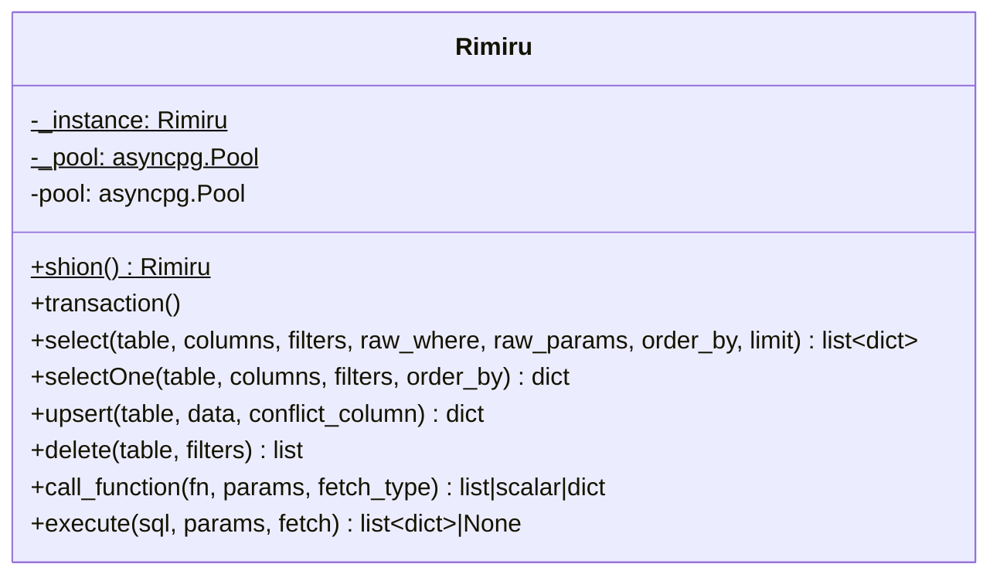

# Database Layer

## `db.py` — `Rimiru`

A singleton wrapping an `asyncpg` connection pool (min 2 / max 10). Accessed
via the async classmethod factory `Rimiru.shion()` — same singleton pattern
as Libra's `JobDatabase.create()`, different name. SSL is enabled on the pool
with `check_hostname` and `verify_mode` both disabled (`ssl.CERT_NONE`) —
worth confirming this is intentional (typical for a managed Postgres provider
behind a proxy) rather than an oversight, since it skips certificate
validation entirely.



Connection config comes from `constants.py` (`PGHOST`, `PGPORT`, `PGUSER`,
`PGPASSWORD`, `PGDATABASE`, loaded via `python-dotenv` from `backend/.env`) —
the same environment-variable shape a Libra deployment uses, since both
projects are meant to point at the same Postgres instance with separate
migrations.

`Rimiru` is now used on the read and write paths: `routes/application.py`
serves the dashboard from it, and `routes/emails.py`'s
`classify_pending_emails` / `resolve_application` write classified emails to
`application` and `messages`. (The stub `/emails` route left in
`backend/app.py` just echoes its body and is dead — the real ingest path is
the pending-emails queue described in [[Ingest-Pipeline]].)

## Methods

| Method | Notes |
|---|---|
| `shion()` | classmethod, singleton — returns the existing instance if the pool is already built |
| `select(table, columns, filters, raw_where, raw_params, order_by, limit)` | supports a simple `filters` dict (`col = $n`) and/or a `raw_where` string with `raw_params` for anything more complex |
| `selectOne(...)` | thin wrapper, `limit=1` |
| `upsert(table, data, conflict_column=None)` | `INSERT ... ON CONFLICT (conflict_column) ...`, JSON-encodes dict/list values. If every column written *is* the conflict column (nothing left to `SET`), it emits `DO NOTHING` with no `RETURNING` and returns `None` — so an already-present row yields `None`, not the row. `resolve_application` does its company insert-or-get with explicit SQL for this reason. |
| `delete(table, filters)` | `DELETE ... WHERE ... RETURNING *`; returns the deleted rows |
| `call_function(fn, params, fetch_type)` | calls a Postgres function; `fetch_type` is a `FetchType` enum (`FETCH`/`FETCHVAL`/`FETCHROW`) |
| `execute(sql, params, fetch)` | escape hatch for raw SQL (joins, `INSERT ... SELECT`, etc.). `fetch=True` → `list[dict]`; `fetch=False` → the asyncpg status string (`"UPDATE 0"`, ...). Values must go through `$1, $2...` placeholders, never string-interpolated |

Every method logs (`DEBUG` for the query, `INFO` for the row count / status)
via [[Logging]] — the per-run `db.log` is a full statement trace.

Unlike Libra's `JobDatabase`, `Rimiru` has no `bulk_upsert` and no
`_serialize`/`_json_default` helpers for UUID/datetime-safe JSON encoding —
`upsert()` inlines `json.dumps(v) if isinstance(v, (dict, list)) else v`
directly, so a `dict`/`list` value containing a `UUID` or `datetime` would
raise `TypeError` the way Libra's did before that fix was added there.

## Schema

No `CREATE TABLE` statement, migration file, or ORM model exists anywhere in
this repo — like Libra, schema changes have been manual statements run
directly against the live shared Postgres instance. The `users`/`messages`
columns below are reconstructed from the code that reads them (Scales +
imap-checker), not dumped from the live DB, so treat exact types/defaults as
approximate. See [[Diagrams]] for the ER diagram
(`docs/diagrams/data_model.md`).

```sql
CREATE TABLE users(
     id uuid NOT NULL DEFAULT gen_random_uuid(),
    email varchar(255) NOT NULL,
    name varchar(255),
    password text,                              -- sha256 hex; null for Google-only accounts
    -- Gmail connection columns are written by the imap-checker service:
    gmail_refresh_token_encrypted text,         -- Fernet
    gmail_history_id bigint,
    gmail_status text,                           -- 'connected' | 'needs_reauth' | null
    last_synced_at timestamp with time zone,
    created_at timestamp with time zone DEFAULT CURRENT_TIMESTAMP,
    updated_at timestamp with time zone DEFAULT CURRENT_TIMESTAMP ,
    PRIMARY KEY(id)
);
CREATE UNIQUE INDEX users_email_unique ON public.users USING btree (lower((email)::text));

CREATE TABLE application(
     id uuid NOT NULL DEFAULT gen_random_uuid(),
    user_id uuid NOT NULL,
    company uuid,
    job_id uuid,
    role_title varchar(1000),
    sender_email varchar(255),
    status text NOT NULL DEFAULT 'applied'::text,
    status_changed_at timestamp with time zone DEFAULT CURRENT_TIMESTAMP,
    emails jsonb NOT NULL DEFAULT '[]'::jsonb,
    notes text,
    created_at timestamp with time zone DEFAULT CURRENT_TIMESTAMP,
    updated_at timestamp with time zone DEFAULT CURRENT_TIMESTAMP ,
    PRIMARY KEY(id) ,
    CONSTRAINT application_user_fkey FOREIGN key(user_id) REFERENCES users(id),
    CONSTRAINT application_company_fkey FOREIGN key(company) REFERENCES company(id),
    CONSTRAINT application_job_fkey FOREIGN key(job_id) REFERENCES job_list(id)
);
CREATE INDEX application_user_id_index ON public.application USING btree (user_id);
-- Superseded (see "Application resolution" below): the dedup key used to be
--   application_user_company_sender_unique ON (user_id, company, lower(sender_email))
-- and is now:
CREATE UNIQUE INDEX application_user_company_unique ON public.application USING btree (user_id, company);
```

`messages` is the per-user email queue, populated by the imap-checker service
(`email.austindwomoh.xyz`) and drained by `classify_pending_emails`:

```sql
-- abridged — imap-checker owns this table
CREATE TABLE messages(
    id uuid PRIMARY KEY DEFAULT gen_random_uuid(),
    user_id uuid NOT NULL REFERENCES users(id),
    from_address varchar,
    subject varchar,
    body_encrypted text,               -- Fernet, decrypted by imap-checker on read
    gmail_message_id text,             -- for the "open in Gmail" dashboard link
    gmail_thread_id text,              -- Gmail threadId; groups a conversation
    classification jsonb,
    application_id uuid REFERENCES application(id),
    status text DEFAULT 'pending',     -- pending -> classified (or row deleted if not job-related)
    received_at timestamptz DEFAULT now()
);
CREATE INDEX messages_user_thread_idx ON messages (user_id, gmail_thread_id);
```

`company` and `job_id` FK straight into **Libra's** `company` and `job_list`
tables (see Libra's Database-Layer wiki page for those) — confirming the
"same DB, separate migrations" relationship: Scales doesn't duplicate Libra's
company/job data, it references it directly. Both are nullable, so an
`application` row can exist without a resolved match to either.

### Application resolution (`resolve_application`)

Once [[Classification]] returns a positive result, `resolve_application`
(`backend/routes/emails.py`) decides which `application` row it belongs to,
in two layers:

1. **Thread match.** If any earlier `messages` row with the same
   `gmail_thread_id` is already linked to an application, this email joins
   that one. This is what stops a recruiter's reply (from a personal
   address) or an OA email (from an assessment vendor) spawning a second
   application for a process already tracked.
2. **Company match.** No thread hit falls back to one row per
   `(user_id, company)`. The LLM's `company_name` is first run through
   `_canonical_company` (strips `Inc/LLC/Ltd/Corp/GmbH/…`, collapses
   whitespace) and matched case-insensitively, so "Google", "Google LLC" and
   "Google, Inc." resolve to a single `company` row. No company name and no
   thread match → the email is left `pending`.

`_advance_status` then moves the application's `status` **forward only**
(`applied → oa → interview → offer/rejected`, per `_STATUS_RANK`) — a
late-arriving "interview" email can't demote an "offer".

The old Postgres function `upsert_application` is **no longer called** — it
keyed on `sender_email`, which is exactly what split one hiring process
across multiple rows. Resolution is now explicit SQL in Python.

**Dedup key change.** `application_user_company_sender_unique`
`(user_id, company, lower(sender_email))` is replaced by
`application_user_company_unique` `(user_id, company)`. Consequence: two
different roles at the same company now collapse into one application row.
That's an accepted trade-off for the desktop use case; revisit if
per-role tracking becomes a requirement (would need `job_id` or
`lower(role_title)` back in the key, plus company-name disambiguation).

`status` is still free-text at the DB level — nothing enforces the
`applied/oa/interview/rejected/offer/ghosted` set; `_advance_status` and
`Duro.VALID_STATUS` enforce it in the app layer only.

### `users` and the Gmail connection

The per-user Gmail OAuth connection is now real, but the token lives in the
**imap-checker** service's own schema
(`gmail_refresh_token_encrypted`, `gmail_history_id`, `gmail_status`,
`last_synced_at` on its `users` view of the shared table), not in the columns
this page originally documented. The Scales backend only reads
`users.gmail_status` (`connected` / `needs_reauth` / unset) to decide whether
to run the connect redirect or kick off `classify_pending_emails`
(`routes/auth.py`). imap-checker owns all Gmail polling and writes the
`messages` queue; Scales never touches Gmail directly.
