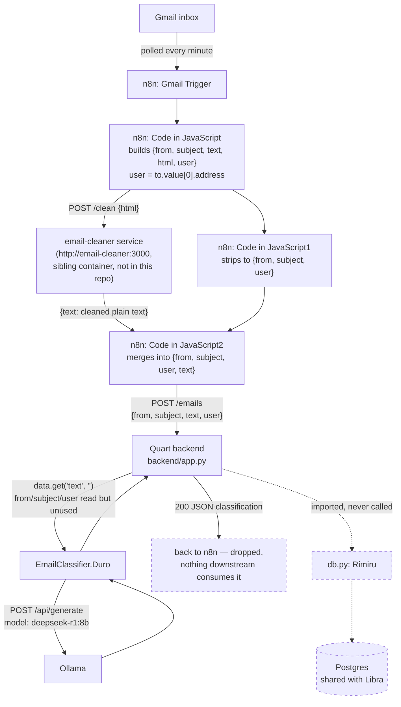

# Ingest Pipeline

How an email gets from Gmail to a classification result. Source: the n8n
workflow export reviewed while writing this doc (not committed anywhere in
this repo — n8n workflows live in the n8n instance, not in source control).

## Step by step

1. **Gmail Trigger** — an n8n `gmailTrigger` node polls the connected Gmail
   account every minute for new mail.
2. **Code in JavaScript** — pulls `from.text`, `subject`, `text`, `html` off
   the raw Gmail message, and derives `user` from `to.value[0].address` (the
   inbox the email was addressed to — this is how a single n8n workflow could
   in principle route emails for multiple tracked users).
3. Two branches run off that node:
   - **HTTP Request1** → `POST http://email-cleaner:3000/clean` with just the
     `html` body, getting back cleaned plain text. This is a separate service
     n8n reaches over its internal Docker network — its implementation isn't
     part of the Scales repo.
   - **Code in JavaScript1** → drops `text`/`html`, keeping just
     `{from, subject, user}`.
4. **Code in JavaScript2** — merges the cleaned text back with the metadata
   into `{from, subject, user, text}`.
5. **HTTP Request** — `POST`s that merged object to
   `https://application.austindwomoh.xyz/emails` (the hosted Quart backend).
   The node's `jsonBody` template has a stray extra quote —
   `\"user\"\":\"{{ $json.user }}\"` — worth checking directly in the n8n
   editor to confirm it's actually producing valid JSON in practice.
6. **`/emails` route** (`backend/app.py`) reads only `data.get("text", "")`
   from the body — `from`, `subject`, and `user` are accepted but never used
   for anything.
7. **`Duro.classify(text)`** (`backend/EmailClassifier.py`) builds a prompt
   asking an LLM to return strict JSON — `is_application_related`,
   `company_name`, `role_title`, `status` — then POSTs it to Ollama's
   `/api/generate` with `model="deepseek-r1:8b"`, `stream=False`, and a 60s
   timeout. See [[Classification]] for the prompt and parsing details.
8. The classification dict is returned as the HTTP response to n8n's request.
   **The `HTTP Request` node has no outgoing connection in the workflow** —
   nothing consumes this response. Combined with `Rimiru` never being called
   from the route, this means **no classified email is currently persisted
   anywhere.**

## Known gaps (as of this writing)

- No Postgres write — `db.py`'s `Rimiru` class exists and is imported in
  `app.py`, but the `/emails` route never calls it.
- `from`/`subject`/`user` are sent by n8n but silently discarded by the
  backend.
- The n8n → backend call is a bare, unauthenticated POST to a public
  hostname — there's no shared secret / auth check in `app.py` beyond the
  Quart `SECRET_KEY` being set (which isn't used for request auth anywhere in
  the current route).
- Per the project owner, this whole synchronous call is planned to be
  replaced by n8n writing to a Postgres queue table instead, with the
  Tauri desktop app pulling from that queue on load. See [[Desktop-Migration]].
